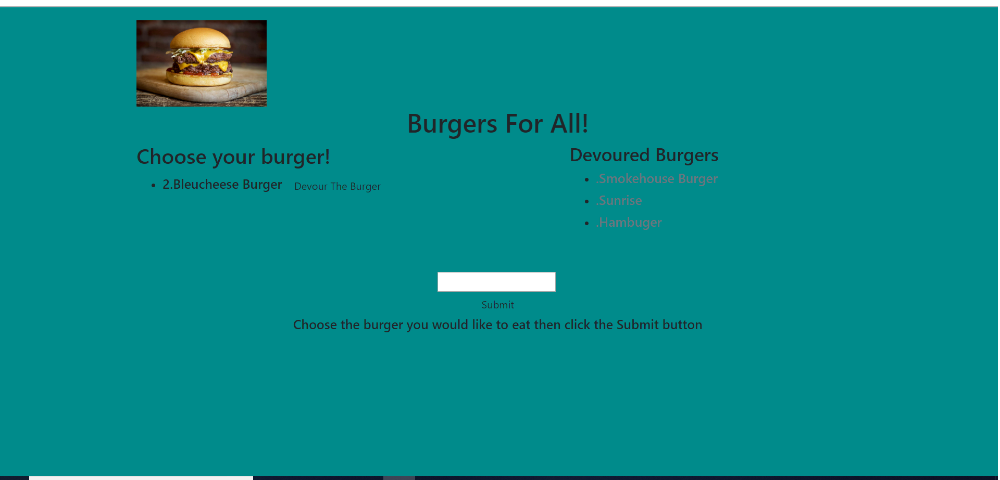

# homework10

Today you will be eating burgers with this program! Also adding more burgers to the site!

# Features

This website shows an sql table of burgers that are the burgers you can devour! With the text box you can add another burger to the list.

# Installation

I have installed express, handlebars, body-parser, method-override, and mysql to run this website.

# How to use 

To use this website, start by clicking the devour button on the list of burgers. Once you click the devour button. The burger will move to the list of burgers you have devoured. The textbox in the center of the site will allow you to create a new burger. You can name the burger anything you want it to be. Once you name your burger, click submit and you create another burger in the Choose you Burger list.

# ScreenShot

This is the screenshot of the deployed site on heroku. It is fully functional